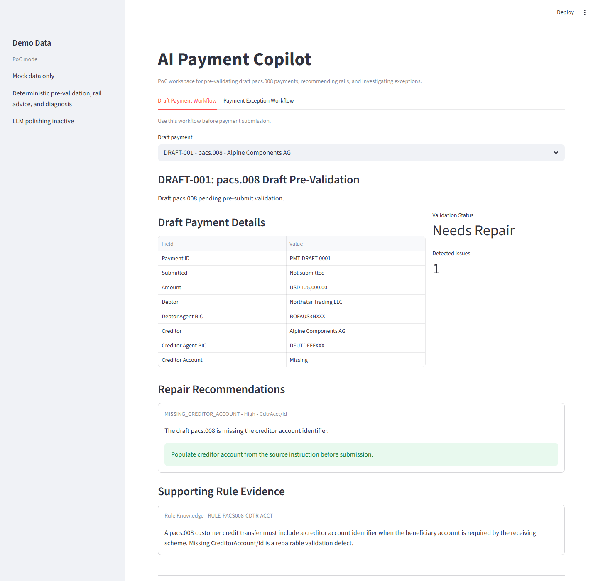

# AI Payment Copilot PoC

A greenfield Streamlit prototype for payment operations teams pre-validating draft
`pacs.008` payments, recommending payment rails, and investigating failed or
rejected payments.



## What It Shows

- A pre-submit validation workspace for draft `pacs.008` payments.
- Suggest-only repair recommendations for predicted validation and routing defects.
- A deterministic payment rail recommendation workspace for ready draft payments.
- A payment investigation workspace with two mock exception cases.
- Deterministic validation and exception classification.
- Lightweight rule knowledge retrieval over mock payment rules.
- Mock operational log lookup.
- An agentic investigation workflow that explains root cause, evidence, and next action.

## Demo Cases

- `DRAFT-001`: draft `pacs.008` would fail because creditor account is missing.
- `DRAFT-002`: draft `pacs.008` would fail because creditor agent BIC is invalid.
- `DRAFT-003`: valid high-value domestic USD draft recommended for wire payment.
- `CASE-001`: `pacs.008` rejected because creditor account is missing.
- `CASE-002`: `pacs.008` failed because creditor agent BIC is invalid.

## PoC Scope

- Pre-validation is shown in a dedicated Streamlit tab beside exception investigation.
- Repair is suggest-only; the PoC does not mutate or auto-repair draft payments.
- Rule scope is limited to missing creditor account and invalid creditor agent BIC.
- Rail recommendation is mock-data only and compares Wire, RTP, ACH, SEPA, and SWIFT.

## Product and Architecture Docs

- [AI use case PRD](docs/ai-payment-copilot-ai-use-case-prd.md): product framing,
  AI user stories, input/output contracts, acceptance criteria, evaluation metrics,
  non-functional requirements, dependencies, and guardrails.
- [GKE architecture diagram](docs/ai-payment-copilot-gke-architecture.drawio):
  editable draw.io diagram for a production deployment with UI, backend API,
  shared `ai-gateway-service`, `ai-rag-service`, and `ai-sre-observability`.

## Production Direction

The intended production path is a GKE deployment that separates the current
Streamlit PoC into an internal UI and backend API layer. Production integration
should replace mock data with payment hub, bank reference data, rail configuration,
operational logs, case management, and compliance systems.

Shared cluster services are expected to provide:

- `ai-gateway-service` for governed LLM/model access.
- `ai-rag-service` for governed rules, policy, runbook, and payment knowledge retrieval.
- `ai-sre-observability` for logs, traces, metrics, health, and alerting.

The initial production pilot should remain read-only and human-in-the-loop:
recommendations are displayed, explained, and audited, but payment repair,
resubmission, rail execution, and compliance decisions require analyst approval.

## Run

```powershell
uv run streamlit run app.py
```

## Test

```powershell
uv run pytest -q
uv run ruff check .
```
